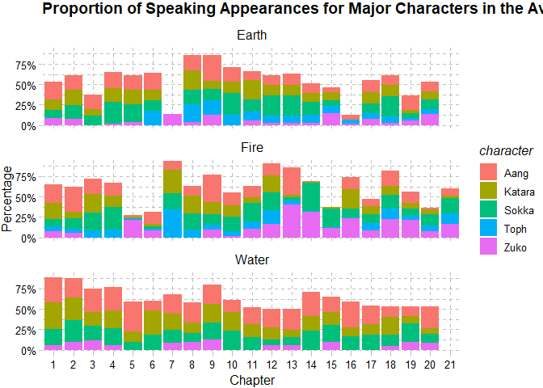

# Load the weekly Data

Dowload the weekly data and make available in the `tt` object.


```r
tt <- tt_load("2020-08-11")
```

```
## --- Compiling #TidyTuesday Information for 2020-08-11 ----
```

```
## --- There are 2 files available ---
```

```
## --- Starting Download ---
```

```
## 
## 	Downloading file 1 of 2: `avatar.csv`
## 	Downloading file 2 of 2: `scene_description.csv`
```

```
## --- Download complete ---
```

# Pull Dataframe


```r
avatar <- tt$avatar
```

# Wrangle

```r
speaking <- avatar %>%
  filter(character != "Scene Description") %>%
  select(book, book_num, chapter, chapter_num, character, character_words) %>%
  group_by(book, book_num, chapter, chapter_num, character) %>%
  count() %>%
  ungroup() %>%
  group_by(book, book_num, chapter, chapter_num) %>%
  mutate(percentage = n/sum(n))
```

# Visualize

Using your processed dataset, create your unique visualization.


```r
speaking %>% 
  filter(character %in% c("Aang", "Katara", "Sokka", "Toph", "Zuko")) %>%
  ggplot() +
  geom_col(mapping = aes(x = as.factor(chapter_num), y = percentage, fill = character)) +
  facet_wrap(~ book, ncol = 1) +
  theme_pander() +
  labs(title = "Proportion of Speaking Appearances for Major Characters in the Avatar Book Series",
      x = "Chapter",
      y = "Percentage") +
  scale_y_continuous(labels = scales::percent)
```

<!-- -->
